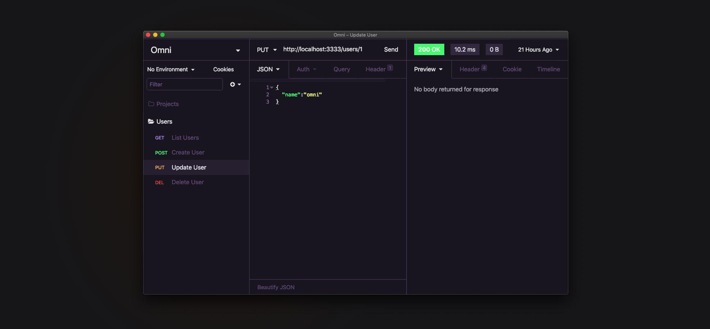

# Omni for [Insomnia](http://insomnia.rest)

> 🎨 Omni is everywhere [Insomnia](http://insomnia.rest)

## Install

- Open **Preferences > Plugins**, search for `@getomni/insomnia` and click **Install Plugin**.
- After that, go to **Themes** (also under preferences) and apply the **Omni** theme.

## Maintainers

This theme is maintained by the Rockeseat team.

 | 
--- | ---
[Mayk Brito](https://github.com/maykbrito) | [João Inácio](https://github.com/birobirobiro)

## License

MIT License
